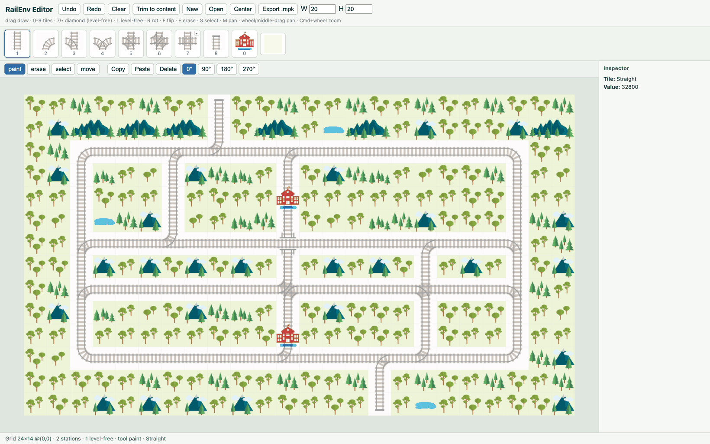
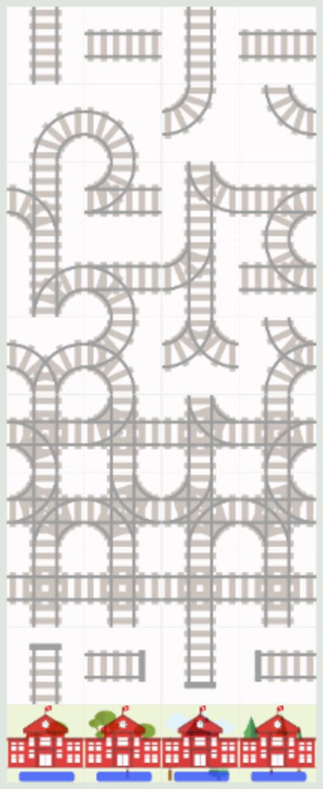

<div align="center">

# RailEnv Editor

**A dependency-free web editor for [Flatland](https://github.com/flatland-association/flatland-rl) railway environments (`RailEnv`).**

Paint a rail grid, place stations, and export a loadable Flatland environment —
entirely in the browser, with no build step and no libraries.

[](https://github.com/MathgeniusTB2/railenv-editor/actions/workflows/ci.yml)
[](LICENSE)
[](https://www.python.org/)
[](tests/)
[](web/)
[](https://github.com/flatland-association/flatland-rl)
[](#contributing)
[](https://mathgeniustb2.github.io/railenv-editor/)

[**Live web editor**](https://mathgeniustb2.github.io/railenv-editor/) &nbsp;·&nbsp;
[Report a bug](https://github.com/MathgeniusTB2/railenv-editor/issues) &nbsp;·&nbsp;
[Discussions](https://github.com/MathgeniusTB2/railenv-editor/discussions)



<sub>A demo network painted in the editor — every tile rendered with Flatland's own PILSVG sprites.</sub>

</div>

---

## Contents

- [Overview](#overview)
- [Features](#features)
- [Screenshots](#screenshots)
- [Quick start](#quick-start)
- [Usage](#usage)
- [Keyboard shortcuts](#keyboard-shortcuts)
- [Export](#export)
- [How it works](#how-it-works)
- [Project layout](#project-layout)
- [Development](#development)
- [Contributing](#contributing)
- [License](#license)

---

## Overview

RailEnv Editor is a single static web page for designing [Flatland](https://github.com/flatland-association/flatland-rl)
railway environments. Draw a network on an infinite canvas, drop in stations,
and export a native `.mpk` file that Flatland reloads without any
conversion. It ships **no framework, no bundler, and no backend** — the whole
editor is plain HTML/CSS/JS, so you can serve the folder or host it anywhere.

The renderer uses the very same sprites and deterministic placement logic as
Flatland itself, so the browser view is a near pixel-for-pixel match of the
environment in Python (mean difference ≈ 4/255, checked by `tools/verify_look.py`).

## Features

| | |
| :-- | :-- |
| **Zero dependencies, zero build** | A single static page (`web/`) — no framework, no bundler, no backend. Serve the folder or drop it on any static host. |
| **Every valid Flatland tile** | Straights, turns, simple/symmetric switches, single/double slips, dead-end, and the diamond crossing (plus a level-free over/under variant). |
| **Stations** | Markers drawn on top of the track. |
| **True-to-Flatland rendering** | The same **PILSVG** sprites and placement logic Flatland itself uses. |
| **Infinite canvas** | Pan without bounds and grow in any direction as you draw; **Trim to content** to crop back. |
| **Editing tools** | Freehand paint, **Shift**+drag for a straight line, select / copy / paste / delete, and undo/redo. |
| **Native export** | Flatland's MessagePack `.mpk`, loadable with `RailEnvPersister`. |

## Screenshots

| Web editor | Every valid tile |
| :--: | :--: |
|  |  |
| A painted network, ready to export. | All 29 valid transitions on one canvas. |

## Quick start

**1. Open the [live demo](https://mathgeniustb2.github.io/railenv-editor/)** — nothing to install.

**2. Or serve the folder locally:**

```bash
python -m http.server 8080 --directory web    # then open http://localhost:8080
```

That's it — the app is pure HTML/CSS/JS and needs no install. To run the
validation tests and tooling you'll need Python 3.10+ and
[uv](https://docs.astral.sh/uv/):

```bash
uv sync --all-extras
```

## Usage

The editor is organised around a **toolbar** (paint, erase, select, move), a
**tile bar** of native PILSVG icons, and a **bottom bar** that reports the
hovered and selected cell (value, 16-bit bits, markers) plus the grid status.

- **Drag** with paint to draw freehand (the brush follows the cursor); hold **Shift** to lock to a straight line. **Erase** is freehand too (clears every cell swept).
- **Auto-expand:** drawing just off the grid grows it in any direction.
- Pan with the wheel, middle-drag, the **Move** tool (`M`) or arrow keys; `Cmd`/`Ctrl` + scroll zooms around the cursor.
- Drag a **marquee** with the select tool, then `Ctrl+C` / `Ctrl+V` / `Del` (paste lands on the cell under the pointer).
- The **▾** on the Diamond tile switches between a plain and a level-free crossing.

### Keyboard shortcuts

**Tools**

| Key | Tool |
| :-- | :-- |
| <kbd>P</kbd> | Paint |
| <kbd>E</kbd> | Erase |
| <kbd>S</kbd> | Select |
| <kbd>M</kbd> | Move / pan |

**Tiles**

| Key | Tile |
| :-- | :-- |
| <kbd>0</kbd> | Station |
| <kbd>1</kbd> | Straight |
| <kbd>2</kbd> | Turn |
| <kbd>3</kbd> | Simple switch |
| <kbd>4</kbd> | Symmetrical switch |
| <kbd>5</kbd> | Single slip |
| <kbd>6</kbd> | Double slip |
| <kbd>7</kbd> | Diamond |
| <kbd>8</kbd> | Dead-end |
| <kbd>L</kbd> | Level-free diamond |

**Editing**

| Shortcut | Action |
| :-- | :-- |
| <kbd>Ctrl</kbd>/<kbd>Cmd</kbd>+<kbd>Z</kbd> | Undo |
| <kbd>Ctrl</kbd>/<kbd>Cmd</kbd>+<kbd>Y</kbd> | Redo |
| <kbd>Ctrl</kbd>/<kbd>Cmd</kbd>+<kbd>C</kbd> | Copy selection |
| <kbd>Ctrl</kbd>/<kbd>Cmd</kbd>+<kbd>V</kbd> | Paste at the hovered cell |
| <kbd>Del</kbd> / <kbd>Backspace</kbd> | Delete selection |
| <kbd>R</kbd> | Rotate the current tile ¹ |
| <kbd>F</kbd> | Flip the current tile ¹ |

**View**

| Input | Action |
| :-- | :-- |
| Wheel / middle-drag | Pan |
| <kbd>Cmd</kbd>/<kbd>Ctrl</kbd>+wheel | Zoom around the cursor |
| Arrow keys | Pan |
| <kbd>Esc</kbd> | Close the diamond menu |

<sub>¹ <kbd>R</kbd> and <kbd>F</kbd> apply only to rotatable rail tiles, not to Station or Empty.</sub>

## Export

Save, open, and export all use a single format: Flatland's native **MessagePack
`.mpk`** env dict, which Flatland reloads with
`RailEnvPersister.load_env_dict(path)` (or `load_new(path)`).

```python
from flatland.envs.persistence import RailEnvPersister

env, env_dict = RailEnvPersister.load_new("network.mpk")
env.reset()
```

<details>
<summary><strong>Editor-only state and file-format details</strong></summary>

Editor-only state that Flatland does not model (canvas origin, station
markers, level-free crossings) rides along under an extra top-level
`railenv_editor` key. `RailEnvPersister.set_full_state` reads only known keys,
so the same file stays a stock, loadable `RailEnv` (pseudo-structure):

```text
{ ...Flatland env_dict...,
  "railenv_editor": { "version": 1, "origin": [x, y],
                      "stations": [[ax, ay], ...],
                      "level_free": [[ax, ay], ...] } }
```

Level-free crossings are also written to Flatland's **standard**
`level_free_positions` key (as local `[row, col]`), so Flatland's
`GridResourceMap` honours them on load.

Both directions are produced by [`web/envpkl.js`](web/envpkl.js)
(`buildEnvMpk` / `parseEnvMpk`) with **no dependencies**, and verified loadable in
Flatland. Legacy JSON project files can still be opened; the legacy pickle writer
(`buildEnvPkl`) is kept for old-Flatland consumers.

> **Note:** `RailEnvPersister.load_env_dict` chooses pickle vs msgpack purely
> from the filename, and its msgpack fallback only catches `ValueError` (not
> `pickle.UnpicklingError`). A msgpack file named `.pkl` therefore hard-fails —
> which is why the format is always `.mpk` here.

</details>

## How it works

The editor is deliberately minimal: a static page plus one self-contained codec.

- **Static by design.** `web/index.html` holds the entire UI, and sprites under
  `web/assets/` are exported from Flatland's own PILSVG art by
  [`tools/export_pilsvg.py`](tools/export_pilsvg.py). There is nothing to compile
  and no runtime dependency to install.
- **Dependency-free serialization.** [`web/envpkl.js`](web/envpkl.js) implements a
  Python **pickle** writer plus a **MessagePack** reader/writer from scratch in
  plain JavaScript (UMD: browser `<script>` and Node). It encodes Flatland's numpy
  grid the way `msgpack_numpy` does, so the output is byte-compatible with
  `RailEnvPersister`.
- **Faithful geometry.** Tile transition bitmaps come from
  [`railtiles.py`](railtiles.py), mirroring `flatland.envs.grid.rail_env_grid`,
  so generated grids are guaranteed valid for `RailEnv`.
- **Verified against Flatland.** [`tests/`](tests/) loads the browser-produced
  `.mpk` back through `flatland-rl`, asserting every cell is a valid transition
  and that grid plus markers round-trip through the dependency-free reader.

## Project layout

```
web/                   the editor (dependency-free, no build step)
  index.html           the app
  envpkl.js            dependency-free pickle + msgpack reader/writer
  assets/              Flatland PILSVG sprites + manifest
  testmaps/            demo and every-tile maps
railtiles.py           Flatland tile catalogue (used by tests/tools)
tools/                 sprite export, test-map generators, screenshots, look-parity check
tests/                 pytest suite validating the exports against flatland-rl
docs/                  README screenshots
```

## Development

```bash
uv sync --all-extras
uv run pytest tests/ -q                 # validate the browser exports against flatland-rl
uv run ruff check .                     # lint
uv run --all-extras python tools/screenshot_web.py    # regenerate docs/ screenshots
```

CI runs lint and tests on every push to `main` and every pull request, and the
web app is deployed to GitHub Pages from `main`.

## Contributing

Issues and pull requests are welcome. Before opening a PR, please run:

```bash
uv run ruff check .
uv run pytest tests/ -q
```

Keep the web app dependency-free — the editor under `web/` must stay a static,
buildless page. The `desktop` branch holds the archived PySide6 desktop
application; `main` is web-only.

## License

[MIT](LICENSE) © 2026 MathgeniusTB2.

Rail sprites and rendering are derived from [Flatland](https://github.com/flatland-association/flatland-rl)
(MIT, © SBB AG), which this project targets.

<div align="center">

<sub><a href="#railenv-editor">Back to top</a></sub>

</div>
